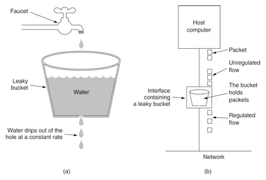

# 高并发下的流量控制

这个时候如果不做任何保护措施，服务器就会承受很大的处理压力，请求量很高，服务器负载也很高，并且当请求超过服务器承载极限的时候，系统就会崩溃，导致所有人都不能访问。

为了应用服务的高可用，一个常用的办法是对大流量的请求（秒杀/抢购）进行限流，拦截掉大部分请求，只允许一部分请求真正进入后端服务器，这样就可以防止大量请求造成系统压力过大导致的系统崩溃，从而保护服务正常可用。

`令牌桶(Token Bucket)`、`漏桶(leaky bucket)`和 `计数器` 算法是最常用的三种限流的算法。

## 限流算法

### 计数器

计数器限流算法也是比较常用的，主要用来限制总并发数。比如限流 `qps` 为 `100` ，算法的实现思路就是从第一个请求进来开始计时，在接下去的 `1s` 内，每来一个请求，就把计数加 `1` ，如果累加的数字达到了 `100` ，那么后续的请求就会被全部拒绝。等到 `1s` 结束后，把计数恢复成 `0` ，重新开始计数。

这种实现方式有一个弊端：如果我在单位时间 `1s` 内的前 `10ms` ，已经通过了 `100` 个请求，那后面的 `990ms` ，只能眼巴巴的把请求拒绝，这种现象称为 **突刺现象**。

### 漏桶

为了消除 **突刺现象**，可以采用漏桶算法实现限流，漏桶算法这个名字就很形象，算法内部有一个容器，类似生活用到的漏斗，当请求进来时，相当于水倒入漏斗，然后从下端小口慢慢匀速的流出。不管上面流量多大，下面流出的速度始终保持不变。

不管服务调用方多么不稳定，通过漏桶算法进行限流，每 `10` 毫秒处理一次请求。因为处理的速度是固定的，请求进来的速度是未知的，可能突然进来很多请求，没来得及处理的请求就先放在桶里，既然是个桶，肯定是有容量上限，如果桶满了，那么新进来的请求就丢弃。

在算法实现方面，可以 **准备一个队列，用来保存请求，另外通过一个线程池定期从队列中获取请求并执行，可以一次性获取多个并发执行**。

这种算法，在使用过后也存在弊端：**无法应对短时间的突发流量**，同时它的优点也是可以平滑网络上的突发流量，请求可以被整形成稳定的流量。

### 令牌桶

从某种意义上讲，**令牌桶算法是对漏桶算法的一种改进，桶算法能够限制请求调用的速率，而令牌桶算法能够在限制调用的平均速率的同时还允许一定程度的突发调用**。

在令牌桶算法中，存在一个桶，用来存放固定数量的令牌。算法中存在一种机制，以一定的速率往桶中放令牌。每次请求调用需要先获取令牌，只有拿到令牌，才有机会继续执行，否则选择选择等待可用的令牌、或者直接拒绝。

放令牌这个动作是持续不断的进行，如果桶中令牌数达到上限，就丢弃令牌，所以就存在这种情况，桶中一直有大量的可用令牌，这时进来的请求就可以直接拿到令牌执行，比如设置 `qps` 为 `100` ，那么限流器初始化完成一秒后，桶中就已经有 100 个令牌了，这时服务还没完全启动好，等启动完成对外提供服务时，该限流器可以抵挡瞬时的 `100` 个请求。所以，只有桶中没有令牌时，请求才会进行等待，最后相当于以一定的速率执行。

实现思路：可以 **准备一个队列，用来保存令牌，另外通过一个线程池定期生成令牌放到队列中，每来一个请求，就从队列中获取一个令牌，并继续执行**。

> 漏桶 VS 令牌桶：两者主要区别在于“漏桶算法”能够强行限制数据的传输速率，而“令牌桶算法”在能够限制数据的平均传输速率外，还允许某种程度的突发传输。在“令牌桶算法”中，只要令牌桶中存在令牌，那么就允许突发地传输数据直到达到用户配置的门限，所以它适合于具有突发特性的流量。

## 集群限流

### Redis 请求窗口

> 采用redis 的计时和计数方式,在规定的时间窗口期,允许通过的最大请求数量

比如为了限制某个资源被每个用户或者商户的访问次数，5s 只能访问 2 次，或者一天只能调用 1000 次，这种需求，单机限流是无法实现的，这时就需要通过集群限流进行实现。

如何实现？为了控制访问次数，肯定需要一个计数器，而且这个计数器只能保存在第三方服务，比如redis。

大概思路：每次有相关操作的时候，就向 `redis` 服务器发送一个 `incr` 命令，比如需要限制某个用户访问 `/index` 接口的次数，只需要拼接用户 id 和接口名生成 `redis` 的 `key` ，每次该用户访问此接口时，只需要对这个 `key` 执行 `incr` 命令，在这个 `key` 带上过期时间，就可以实现指定时间的访问频率。

### Nginx 限流

Nginx按请求速率限速模块使用的是漏桶算法，即能够强行保证请求的实时处理速度不会超过设置的阈值。

Nginx官方版本限制IP的连接和并发分别有两个模块：
  - `limit_req_zone` 用来限制单位时间内的请求数，即速率限制,采用的漏桶算法 "leaky bucket"。
  - `limit_req_conn` 用来限制同一时间连接数，即并发限制。
