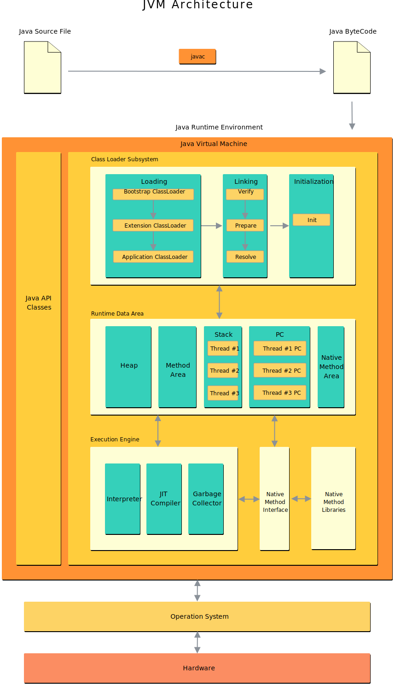

# JVM 架构

Java 源码通过 javac 编译为 Java 字节码 ，Java 字节码是 Java 虚拟机执行的一套代码格式，其抽象了计算机的基本操作。大多数指令只有一个字节，而有些操作符需要参数，导致多使用了一些字节。

JVM 的基本架构如上图所示，其主要包含三个大块：
- 类加载器：负责动态加载Java类到Java虚拟机的内存空间中。
- 运行时数据区：存储 JVM 运行时所有数据
- 执行引擎：提供 JVM 在不同平台的运行能力

## 线程

在 JVM 中运行着许多线程，这里面有一部分是应用程序创建来执行代码逻辑的 **应用线程**，剩下的就是 JVM 创建来执行一些后台任务的 **系统线程**。

主要的系统线程有：
- **Compile Threads**：运行时将字节码编译为本地代码所使用的线程
- **GC Threads**：包含所有和 GC 有关操作
- **Periodic Task Thread**：JVM 周期性任务调度的线程，主要包含 JVM 内部的采样分析
- **Singal Dispatcher Thread**：处理 OS 发来的信号
- **VM Thread**：某些操作需要等待 JVM 到达 **安全点（Safe Point）**，即堆区没有变化。比如：GC 操作、线程 Dump、线程挂起 这些操作都在 VM Thread 中进行。

按照线程类型来分，在 JVM 内部有两种线程：
  - `守护线程`：通常是由虚拟机自己使用，比如 GC 线程。但是，Java程序也可以把它自己创建的任何线程标记为守护线程（`public final void setDaemon(boolean on)`来设置，但必须在`start()`方法之前调用）。

  - `非守护线程`：main方法执行的线程，我们通常也称为用户线程。

**只要有任何的非守护线程在运行，Java程序也会继续运行**。当该程序中所有的非守护线程都终止时，虚拟机实例将自动退出（守护线程随 JVM 一同结束工作）。

守护线程中不适合进行IO、计算等操作，因为守护线程是在所有的非守护线程退出后结束，这样并不能判断守护线程是否完成了相应的操作，如果非守护线程退出后，还有大量的数据没来得及读写，这将造成很严重的后果。