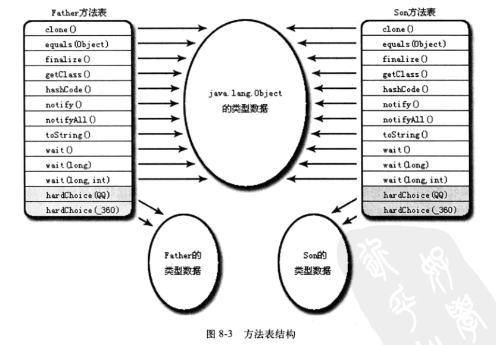

# Java分派机制

在Java中，符合“编译时可知，运行时不可变”这个要求的方法主要是静态方法和私有方法。这两种方法都不能通过继承或别的方法重写，因此它们适合在类加载时进行解析。

Java虚拟机中有四种方法调用指令：
- `invokestatic`：调用静态方法。
- `invokespecial`：调用实例构造器<init>方法，私有方法和super。
- `invokeinterface`：调用接口方法。
- `invokevirtual`：调用以上指令不能调用的方法（虚方法）。

只要能被`invokestatic`和`invokespecial`指令调用的方法，都可以在解析阶段确定唯一的调用版本，符合这个条件的有：静态方法、私有方法、实例构造器、父类方法，他们在类加载的时候就会把符号引用解析为改方法的直接引用。这些方法被称为非虚方法，反之其他方法称为虚方法（final方法除外）。

>虽然final方法是使用`invokevirtual `指令来调用的，但是由于它无法被覆盖，多态的选择是唯一的，所以是一种非虚方法。

## 静态分派

> 对于类字段的访问也是采用静态分派

`People man = new Man()`

**静态分派主要针对重载**，方法调用时如何选择。在上面的代码中，`People`被称为变量的引用类型，`Man`被称为变量的实际类型。**静态类型是在编译时可知的，而动态类型是在运行时可知的**，编译器不能知道一个变量的实际类型是什么。

**编译器在重载时候通过参数的静态类型而不是实际类型作为判断依据**。并且静态类型在编译时是可知的，所以编译器根据重载的参数的静态类型进行方法选择。

> 在某些情况下有多个重载，那编译器如何选择呢？
> 编译器会选择"最合适"的函数版本，那么怎么判断"最合适“呢？越接近传入参数的类型，越容易被调用。

## 动态分派

动态分派主要针对重写，使用`invokevirtual`指令调用。`invokevirtual`指令多态查找过程：
  - 找到操作数栈顶的第一个元素所指向的对象的实际类型，记为C。
  - 如果在类型C中找到与常量中的描述符合简单名称都相符的方法，则进行访问权限校验，如果通过则返回这个方法的直接引用，查找过程结束；如果权限校验不通过，返回java.lang.IllegalAccessError异常。
  - 否则，按照继承关系从下往上一次对C的各个父类进行第2步的搜索和验证过程。
  - 如果始终没有找到合适的方法，则抛出 java.lang.AbstractMethodError异常。

## 虚拟机动态分派的实现

由于动态分派是非常繁琐的动作，而且动态分派的方法版本选择需要考虑运行时在类的方法元数据中搜索合适的目标方法，**因此在虚拟机的实现中基于性能的考虑，在方法区中建立一个虚方法表**（`invokeinterface `有接口方法表），来提高性能。

虚方法表中存放各个方法的实际入口地址。如果某个方法在子类没有重写，那么子类的虚方法表里的入口和父类入口一致，如果子类重写了这个方法，那么子类方法表中的地址会被替换为子类实现版本的入口地址。
